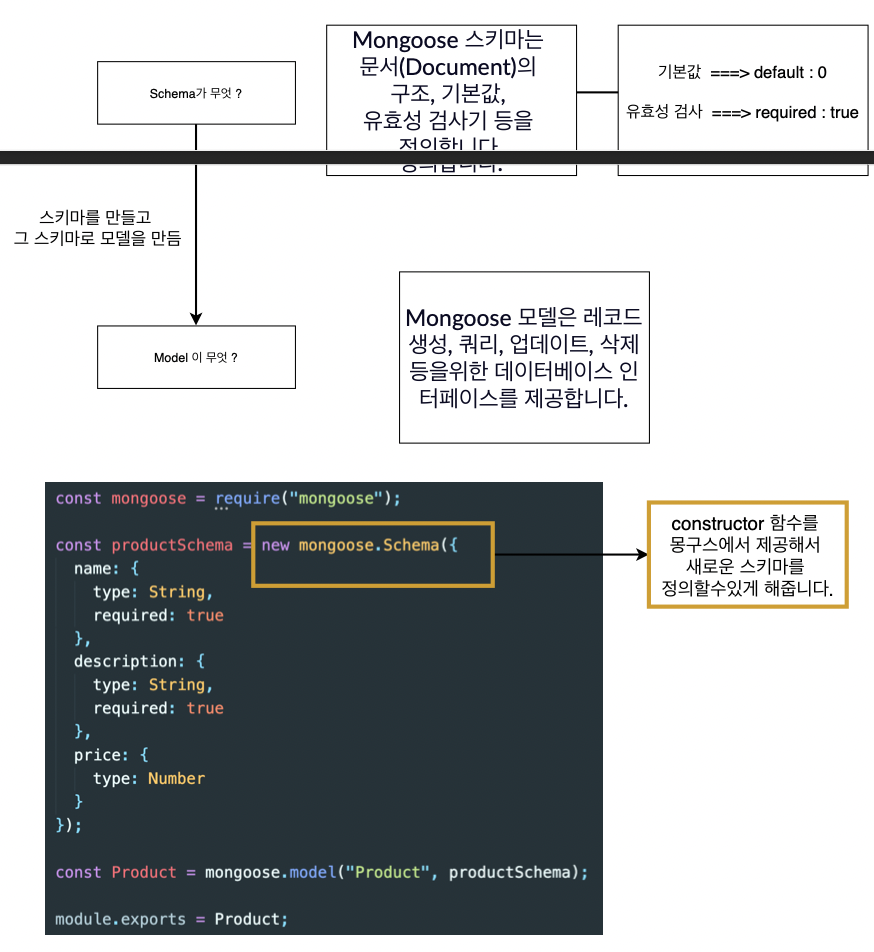
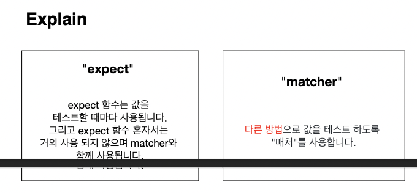

# [따라하며 배우는 TDD 개발] 1. 강의 소개 & 애플리케이션 기본 구조

> [인프런](https://inf.run/Jo1k)

### 목차

- 강의 소개
- Node.js 설치하기
- package.json 파일 작성하기
- server.js 파일 작성하기
- express.json()
- route, controller 생성
- MongoDB 클러스터 생성
- 몽구스 Model, Schema 생성
- 단위 테스트 ?
- Jest ?
- Jest 파일 구조 및 사용법
- jest.fn()

## \#1. 강의 소개

## \#2. Node.js 설치하기

## \#3. package.json 파일 작성하기

## \#4. server.js 파일 작성하기

## \#5. express.json()

## \#6. route, controller 생성

## \#7. MongoDB 클러스터 생성

## \#8. 몽구스 Model, Schema 생성

## \#9. 단위 테스트 ?

## \#10. Jest ?

## \#11. Jest 파일 구조 및 사용법

## \#12. jest.fn()

