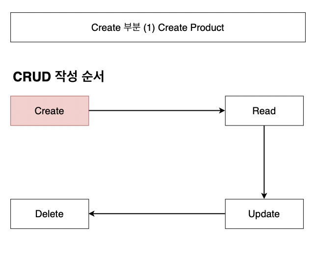

# [따라하며 배우는 TDD 개발] 2. Create 단위 테스트 작성

> [인프런](https://inf.run/Jo1k)

### 목차

- Create Product 함수 생성
- Create Method로 데이터 저장하기
- Node.js 앱을 테스트하기 위한 Jest 설정
- node-mocks-http
- beforeEach
- 상태 값 전달
- 결과 값 전달

## \#1. Create Product 함수 생성

## \#2. Create Method로 데이터 저장하기

## \#3. Node.js 앱을 테스트하기 위한 Jest 설정

## \#4. node-mocks-http

## \#5. beforeEach

## \#6. 상태 값 전달

## \#7. 결과 값 전달

