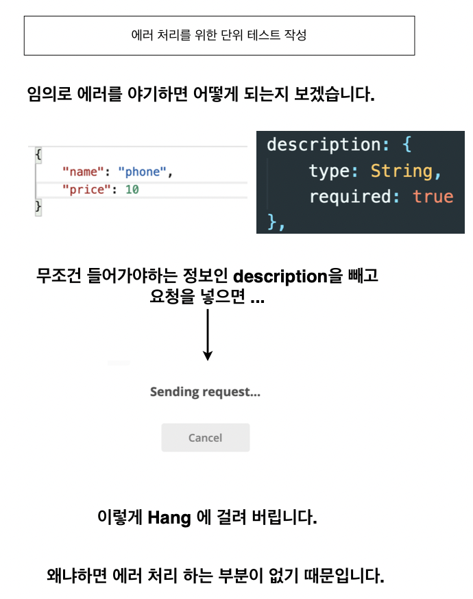

# [따라하며 배우는 TDD 개발] 3. Create 에러 처리

> [인프런](https://inf.run/Jo1k)

### 목차

- 포스트맨 설치하기
- 임의로 데이터를 저장할 때 만나는 문제점
- async await
- 에러 처리를 위한 단위 테스트 작성

## \#1. 포스트맨 설치하기

## \#2. 임의로 데이터를 저장할 때 만나는 문제점

## \#3. async await

## \#4. 에러 처리를 위한 단위 테스트 작성

