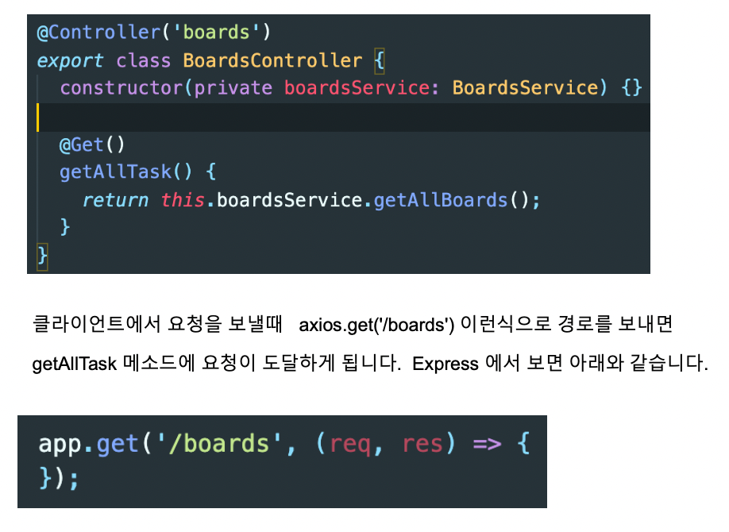
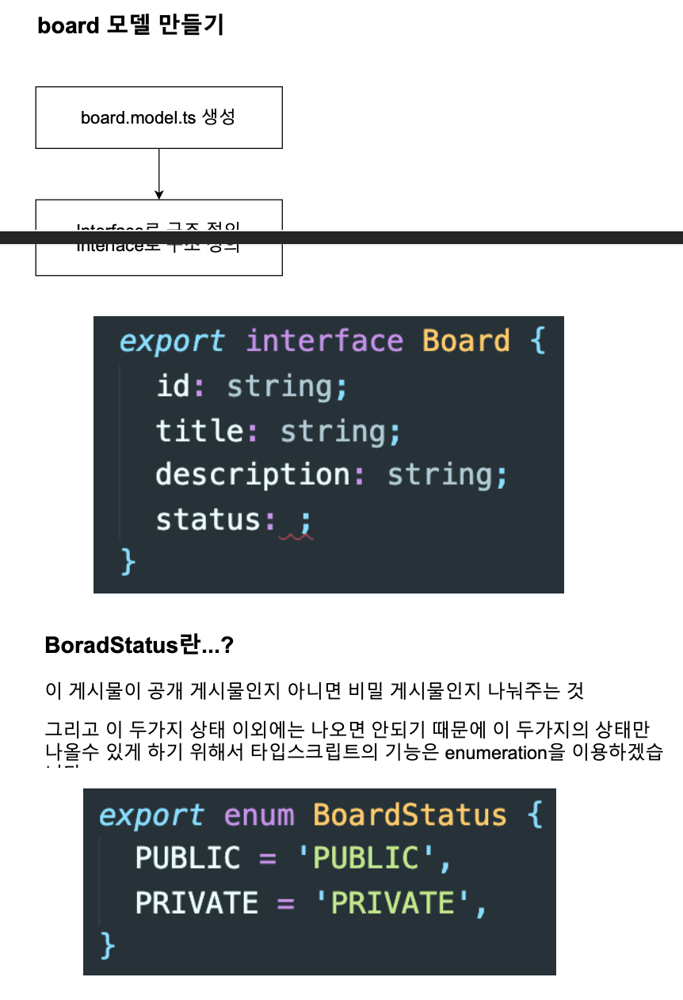
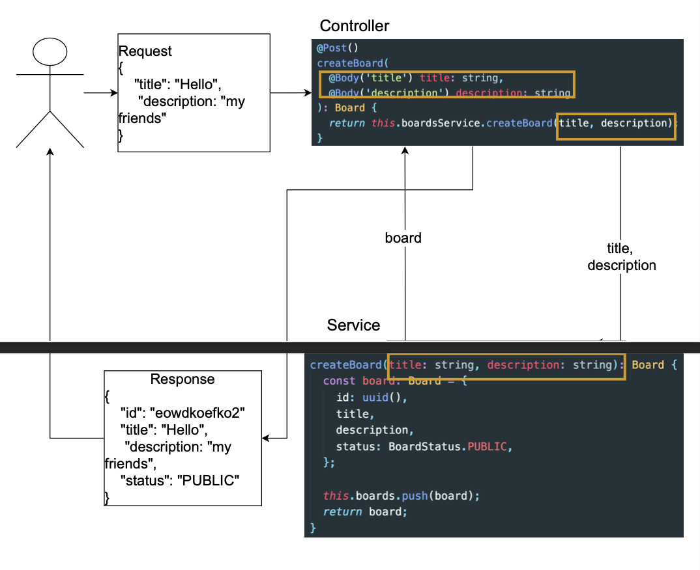
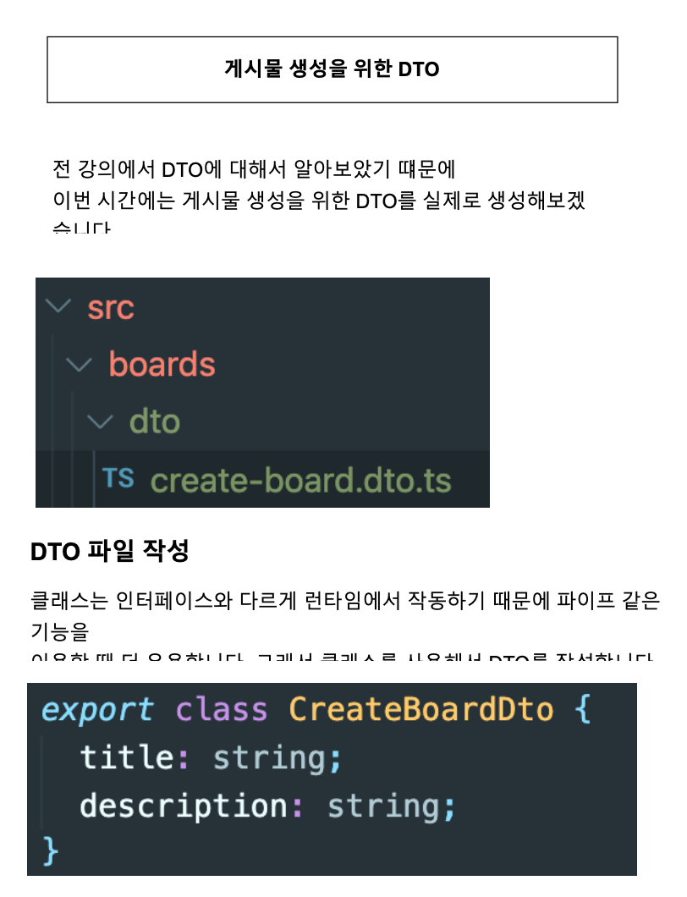

# 섹션 3. CRUD 구현

> 사이트: [따라하며 배우는 NestJS](https://inf.run/n39u)
>
> [소스 코드 저장소](https://github.com/jaewonhimnae/nestjs-board-app)

### 목차

- 모든 게시물을 가져오는 Service 만들기
- Board Model 정의하기
- 게시물 생성하기 (Service 부분)
- 게시물 생성하기 (Controller 부분)
- Data Transfer Object (DTO)
- 게시물 생성을 위한 DTO
- ID로 특정 게시물 가져오기
- ID로 특정 게시물 지우기
- 특정 게시물의 상태 업데이트

## \#1. 모든 게시물을 가져오는 Service 만들기

- 짤린 부분: 우선 데이터를 로컬 메모리에 담아서 처리해보겠습니다

## \#2. Board Model 정의하기

## \#3. 게시물 생성하기 (Service 부분)

## \#4. 게시물 생성하기 (Controller 부분)

## \#5. Data Transfer Object (DTO)

## \#6. 게시물 생성을 위한 DTO

## \#7. ID로 특정 게시물 가져오기

## \#8. ID로 특정 게시물 지우기

## \#9. 특정 게시물의 상태 업데이트

