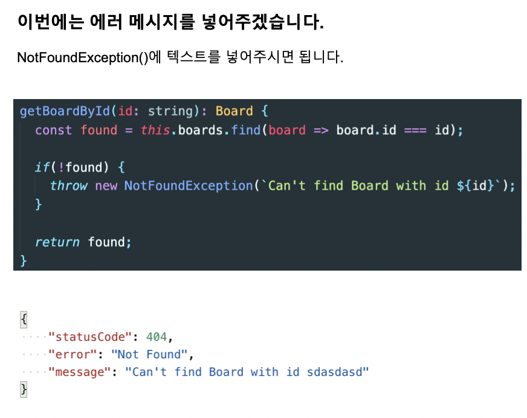

# 섹션 4. Pipe 이용

> 사이트: [따라하며 배우는 NestJS](https://inf.run/n39u)
>
> [소스 코드 저장소](https://github.com/jaewonhimnae/nestjs-board-app)

### 목차

- NestJS Pipes
- 파이프를 이용한 유효성 체크
- 특정 게시물을 찾을 때 없는 경우 결과 값 처리
- 없는 게시물을 지우려 할 때 결과 값 처리
- 커스텀 파이프를 이용한 유효성 체크

## \#1. NestJS Pipes

## \#2. 파이프를 이용한 유효성 체크

## \#3. 특정 게시물을 찾을 때 없는 경우 결과 값 처리

## \#4. 없는 게시물을 지우려 할 때 결과 값 처리

## \#5. 커스텀 파이프를 이용한 유효성 체크

