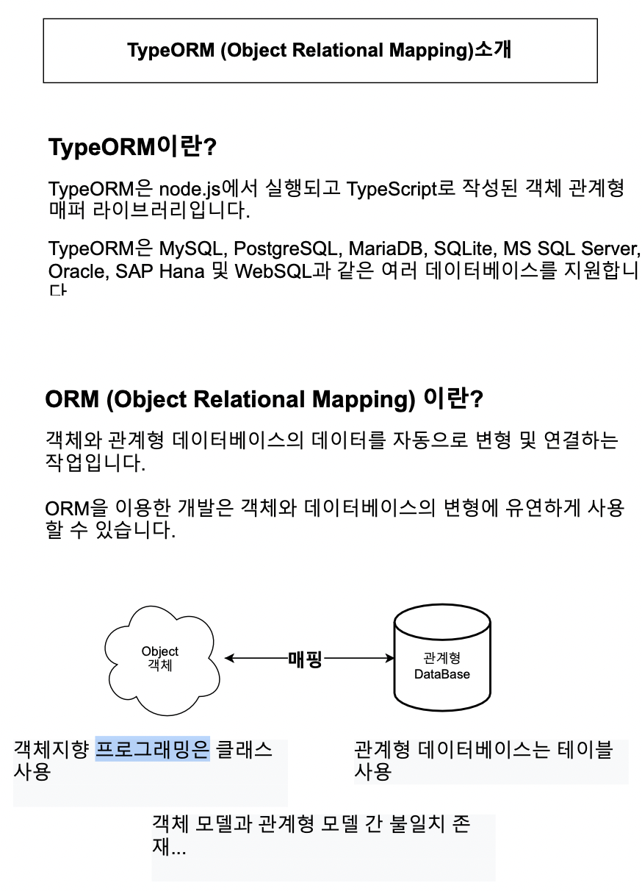
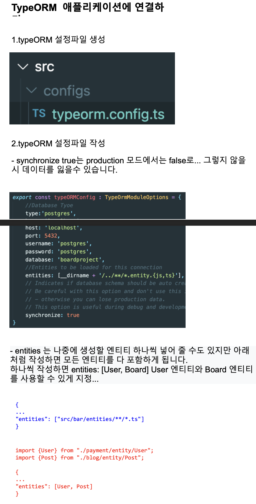

# 섹션 5. Postgres & TypeORM 연동

> 사이트: [따라하며 배우는 NestJS](https://inf.run/n39u)
>
> [소스 코드 저장소](https://github.com/jaewonhimnae/nestjs-board-app)

### 목차

- PostgresSQL 설치
- TypeORM 소개
- TypeORM 이용
- 게시물을 위한 엔티티 생성하기
- Repository 생성하기

## \#1. PostgresSQL 설치

## \#2. TypeORM 소개

## \#3. TypeORM 이용

## \#4. 게시물을 위한 엔티티 생성하기

## \#5. Repository 생성하기

