# 섹션 6. 데이터베이스를 이용한 CRUD 구현

> 사이트: [따라하며 배우는 NestJS](https://inf.run/n39u)
>
> [소스 코드 저장소](https://github.com/jaewonhimnae/nestjs-board-app)

### 목차

- 데이터베이스를 위한 소스코드 정리
- ID를 이용해서 특정 게시물 가져오기
- 게시물 생성하기
- 게시물 삭제하기 
- 게시물 상태 업데이트하기
- 모든 게시물 가져오기

## \#1. 데이터베이스를 위한 소스코드 정리

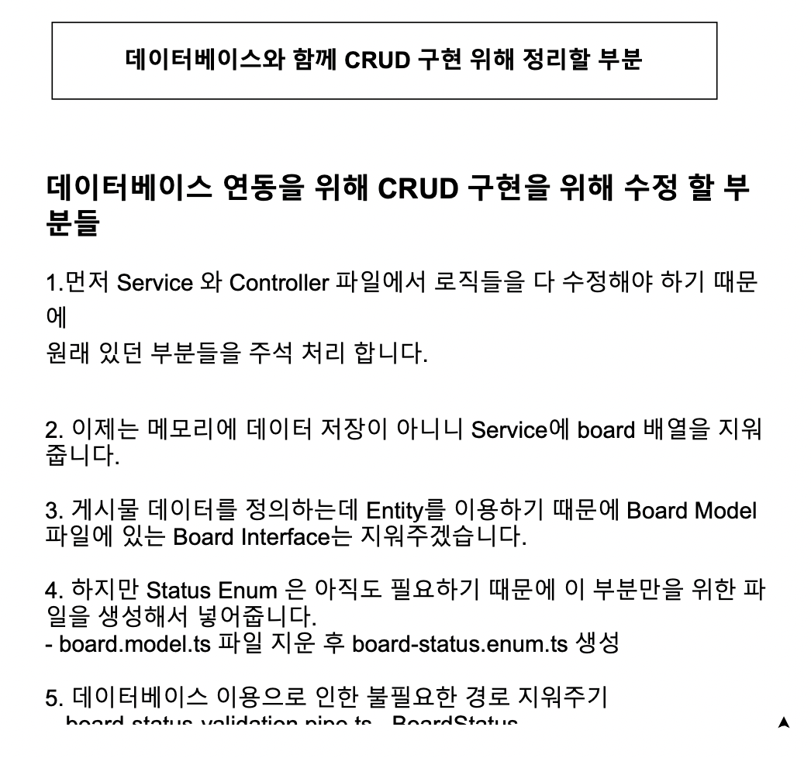

## \#2. ID를 이용해서 특정 게시물 가져오기

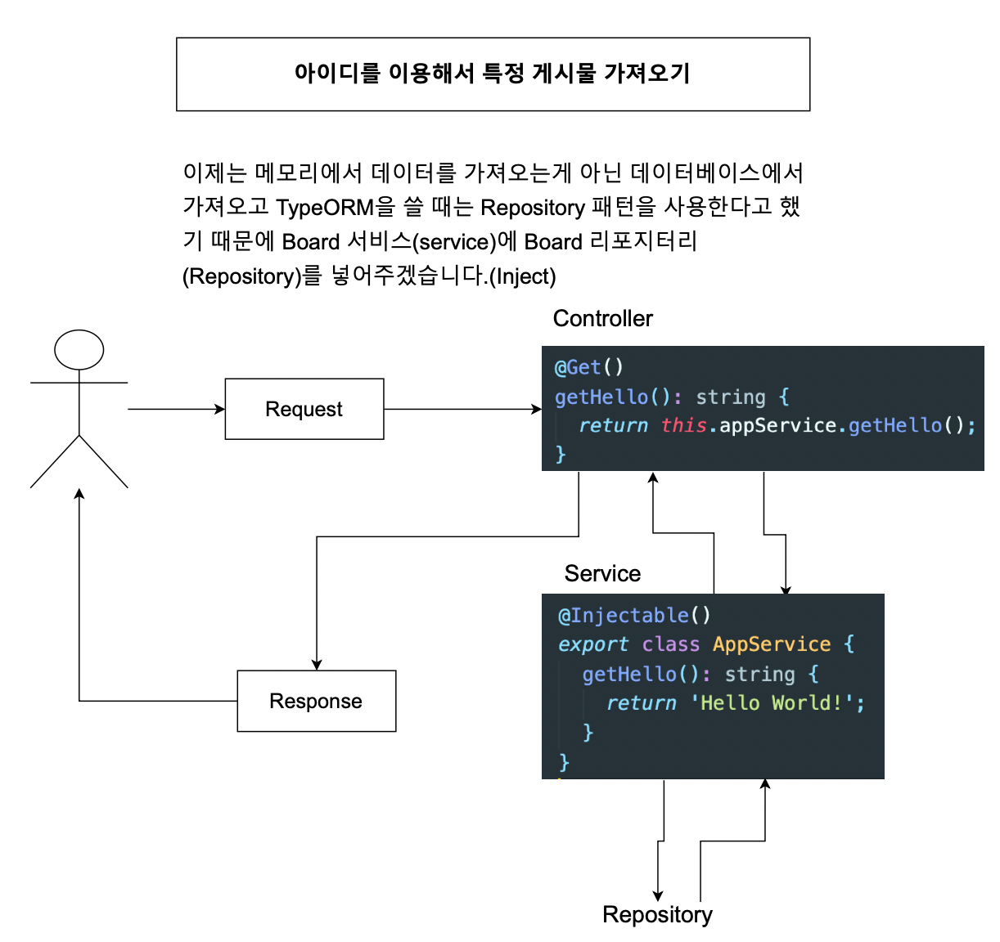

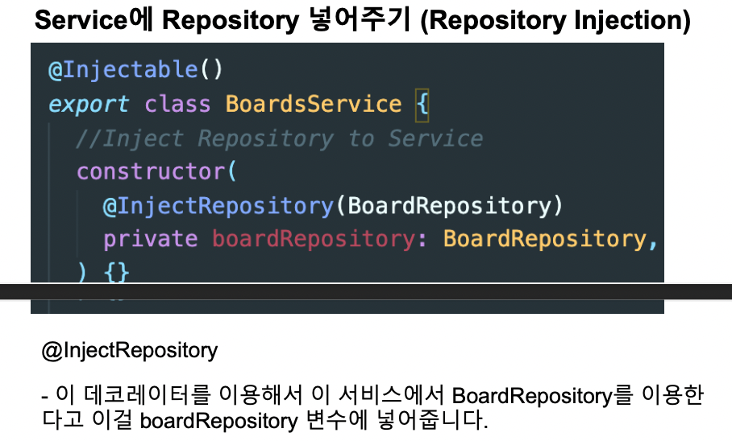

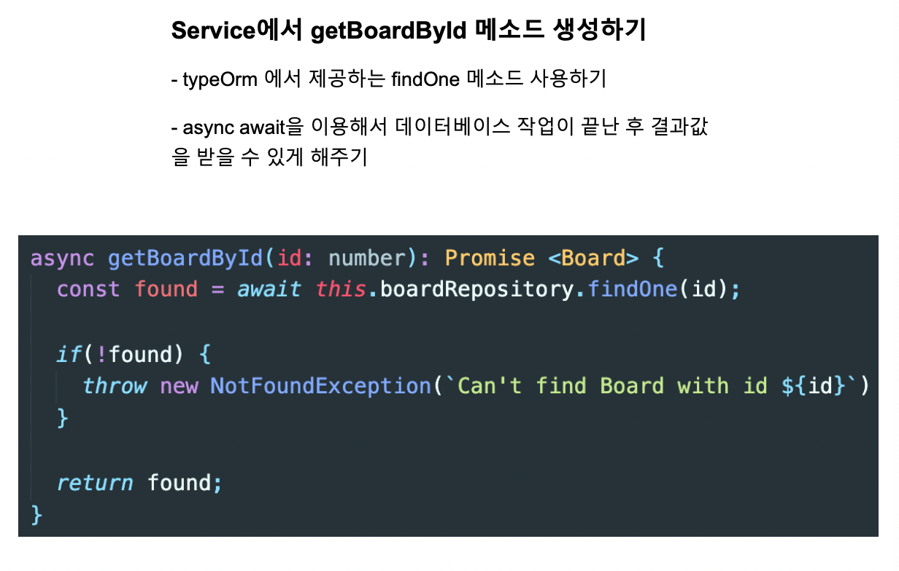

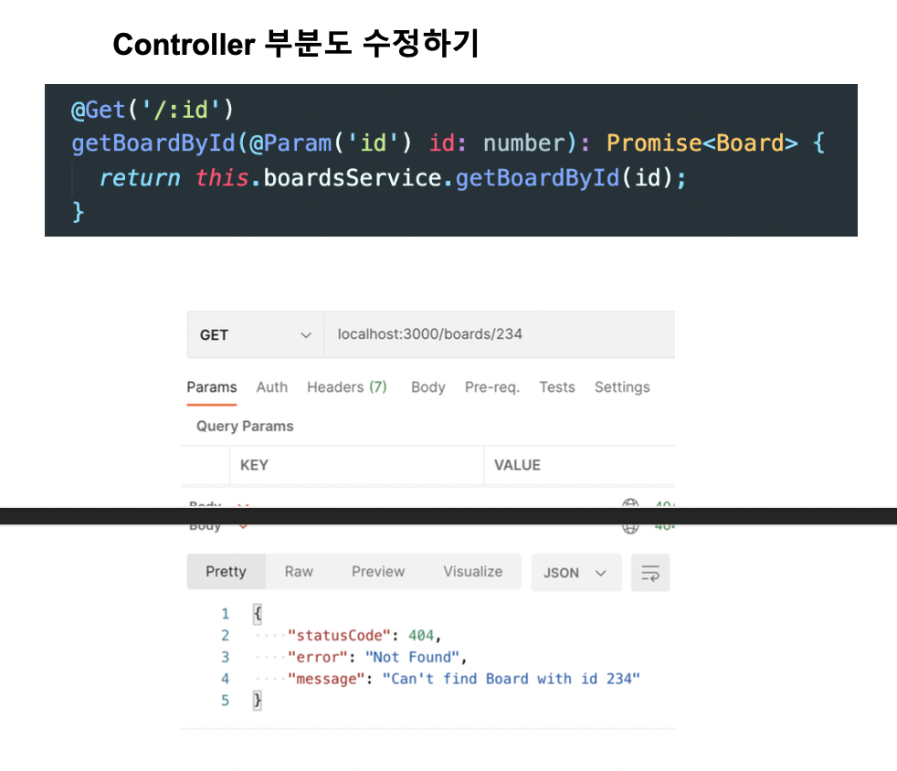

## \#3. 게시물 생성하기

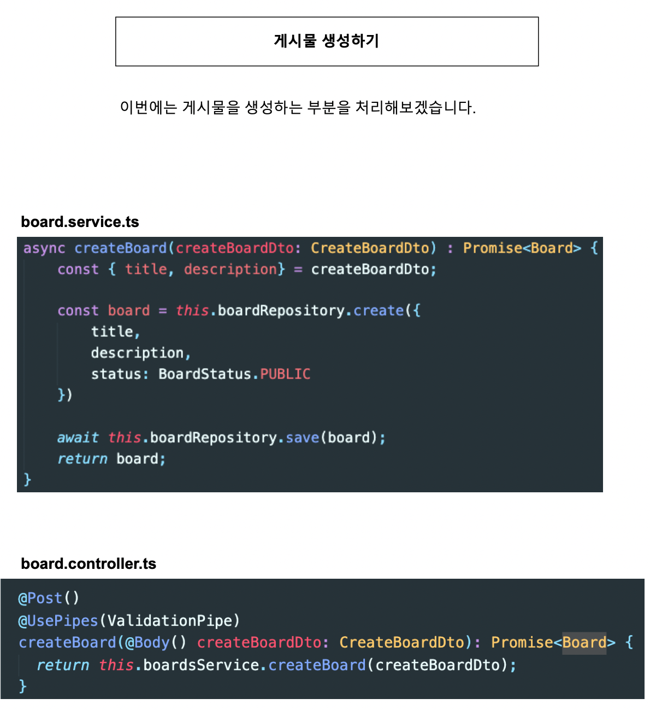

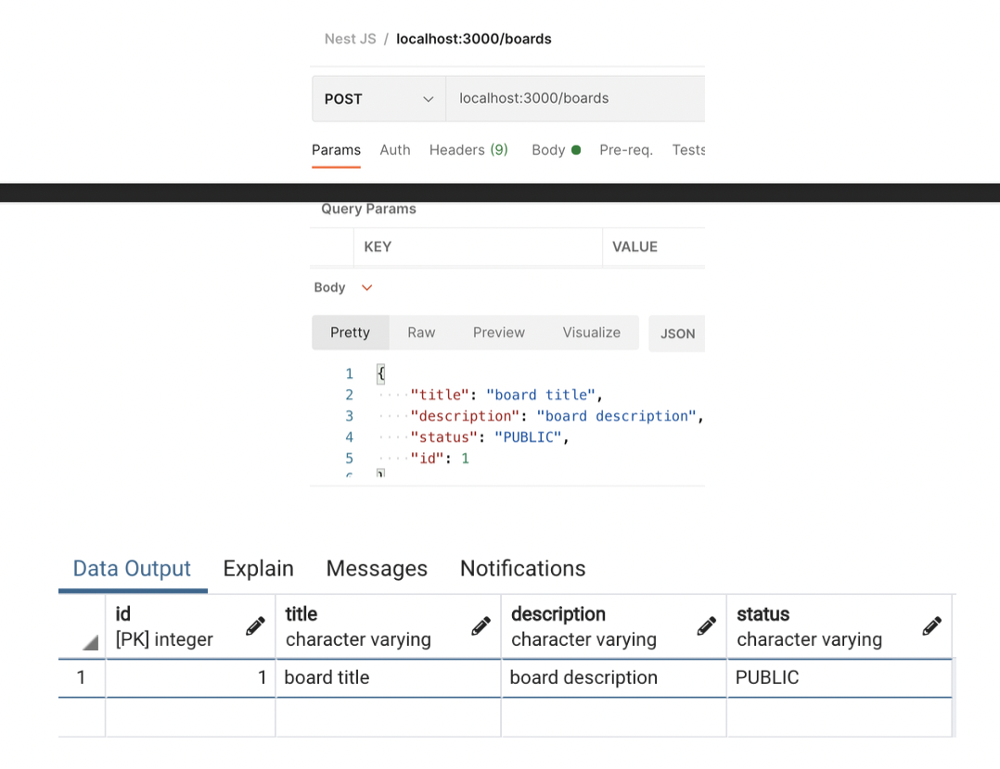

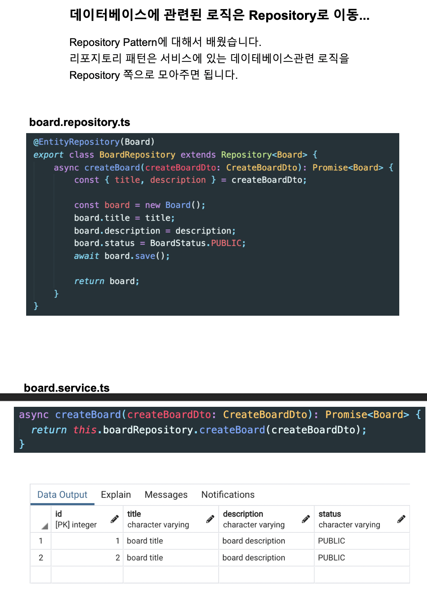

## \#4. 게시물 삭제하기 

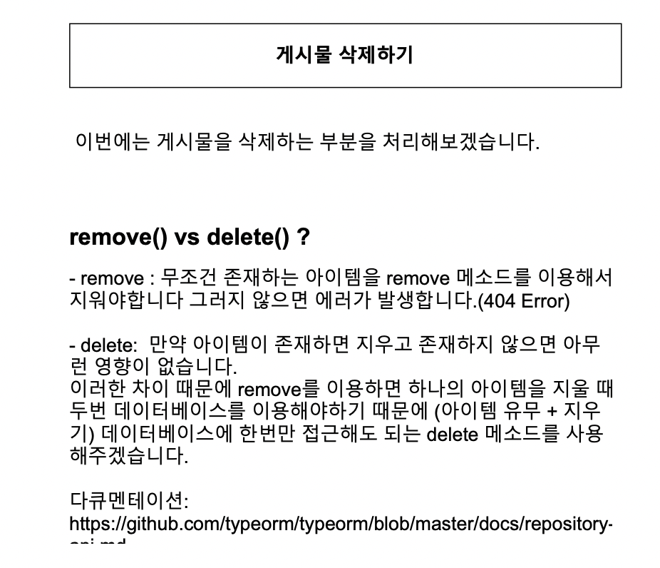

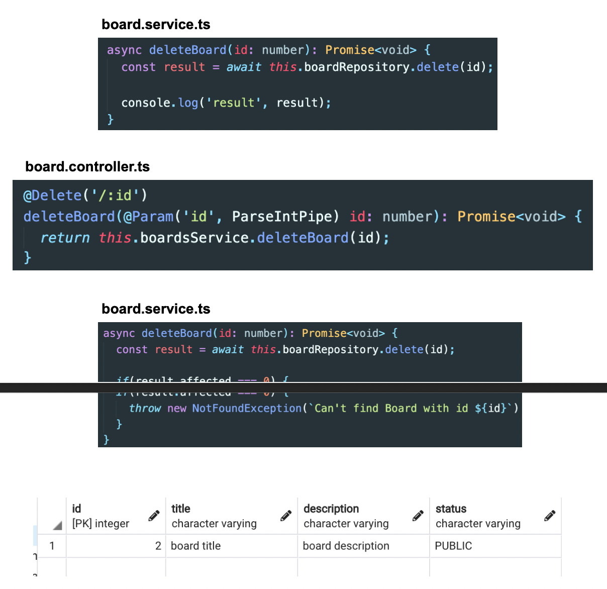

## \#5. 게시물 상태 업데이트하기

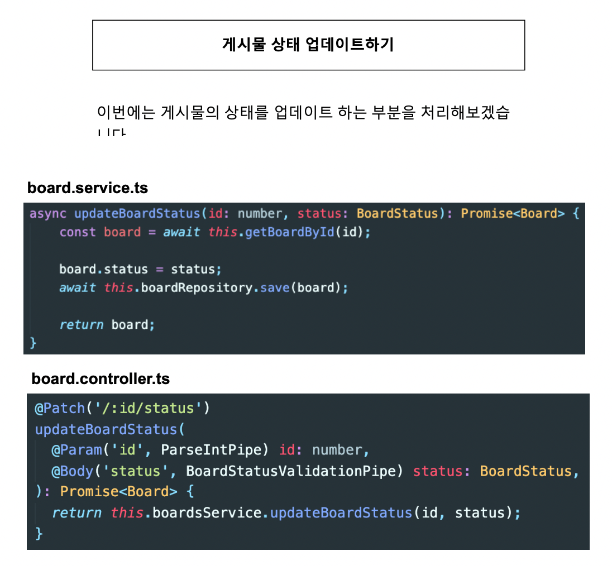

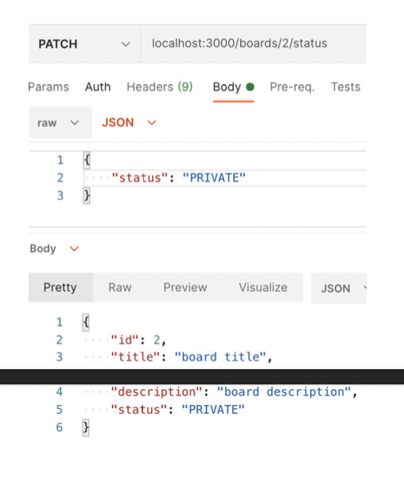

## \#6. 모든 게시물 가져오기

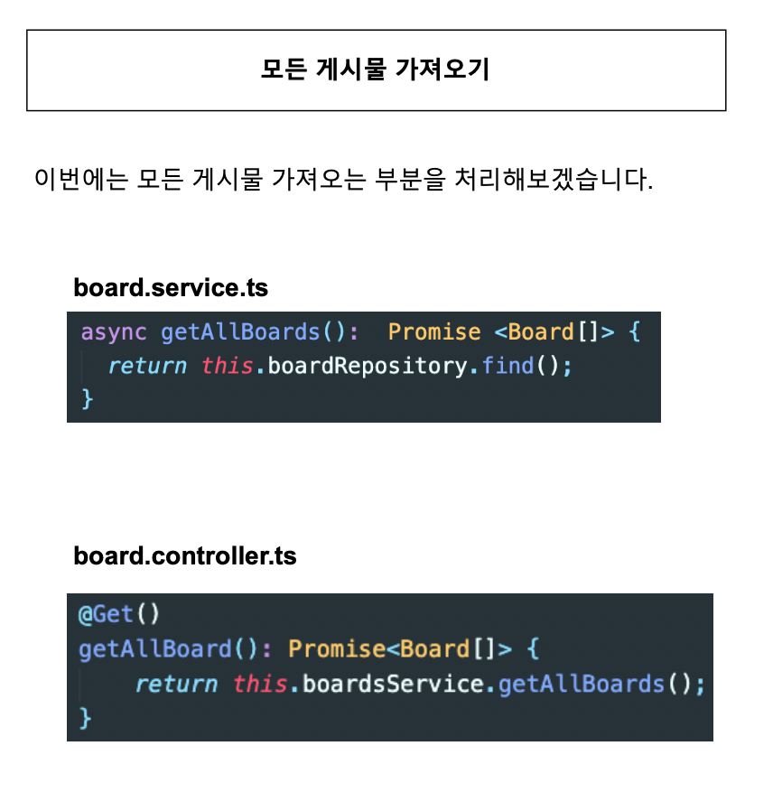
