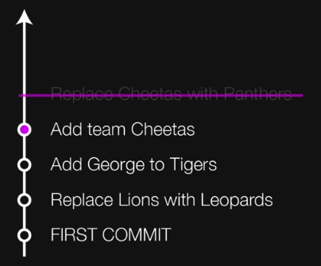
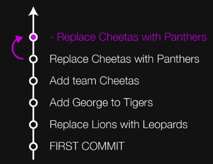
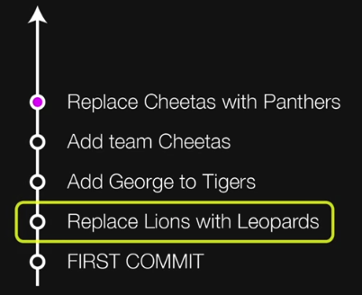
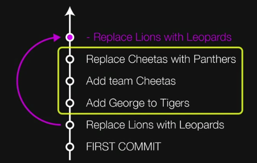

# [제대로 파는 Git & Github] 2. 시간 여행하기

> 사이트: https://inf.run/4Pro


- 목차
  - 변화를 타임캡슐에 담아 묻기
  - 과거로 돌아가는 두 가지 방법
  - 과거로 돌아가기 실습
  - SourceTree로 진행해보기


## 1. 변화를 타임캡슐에 담아 묻기

### (1) 프로젝트의 변경사항들을 타임캡슐(버전)에 담기

- 변경사항 확인 `git status`
  - 추적하지 않는(untracked) 파일: Git의 관리에 들어간 적이 없는 파일

- 파일 하나 담기
  - `git add tigers.yaml`
  - 파일을 담은 후 `git status`로 확인할 수 있다.
- 모든 파일 담기
  - `git add .`
  - 파일을 담은 후 `git status`로 확인할 수 있다.


### (2) 타임캡슐 묻기

- 커밋 명령 `git commit`
- 커밋 메시지까지 함께 작성하기
  - `git commit -m "initial commit"`
- 아래 명령어와 소스트리로 확인
  - `git log`


### (3) 다음 변경사항들을 만들고 타임캡슐에 묻기

- 변경사항

  - `lions.yaml` 파일 삭제
  - `tigers.yaml`의 manager를 `Donald`로 변경
  - `leopards.yaml` 파일 추가

  ```yaml
  team: Leopards
  
  manager: Luke
  
  members:
  - Linda
  - William
  - David
  ```

- `git status`로 확인
  - 파일의 추가, 변경, 삭제 모두 내역으로 저장할 대상
- `git diff`로 확인


- 캡슐에 담기
  - `git add .` 로 캡슐에 담고,
  - `git status`로 확인 후
  - `git commit -m "Replace Lions with Leopards"`로 커밋


> **TIP** `add`와 `commit` 한꺼번에 하기
>
> ```shell
> git commit -am "(메시지)"
> ```
>
> - 새로 추가된(untracked) 파일이 없을 때 한정


### (4) 다음 강을 위한 준비

다음의 세 커밋들을 추가하기


#### 첫 번째 추가 커밋

- Tigers의 `members`에 `George` 추가
- 커밋 메시지: `Add George to Tigers`


#### 두 번째 추가 커밋

- `cheetas.yaml` 추가

```yaml
team: Cheetas

manager: Laura

members:
- Ryan
- Anna
- Justin
```

- 커밋 메시지: `Add team Cheetas`


#### 세 번째 추가 커밋

- `cheetas.yaml` 삭제
- Leopards의 `manager`를 `Nora`로 수정
- `panthers.yaml` 추가

```yaml
team: Panthers

manager: Sebastian

members:
- Violet
- Stella
- Anthony
```

- 커밋 메시지: `Replace Cheetas with Panthers`


## 2. 과거로 돌아가는 두 가지 방법

- `reset`: 원하는 시점으로 돌아간 뒤 이후 내역들을 지웁니다.

  

  - Replace Cheetas with Panthers 커밋을 삭제해서 Add team Cheetas 버전으로 돌아감


- `revert`: 되돌리기 원하는 시점의 커밋을 거꾸로 실행합니다.

  

  - Replace Cheetas with Panthers에서의 변화를 거꾸로 수행하는 커밋을 하나 새로 추가함으로써 Add team Cheetas 버전으로 돌아감




- Replace Cheetas with Panthers, Add team Cheetas, Add George to Tigers는 그대로 유지한채 Replace Lions with Leopards에서 실행했던 내용만 취소하고 싶은 경우 `revert`로 되돌려야 함




## 3. 과거로 돌아가기 실습

### (1) 실습 전 내역 백업

- `.git` 폴더를 복사해두기
  - 맥에서 숨김 파일 보기: cmd + shift + .
- `.git` 폴더 없앤 다음 `git status` 확인해보기


### (2) `reset` 사용해서 과거로 돌아가기

- `git log`로 커밋 내역 확인
  - 되돌아갈 시점: `Add team Cheetas`의 커밋 해시 복사
- `git reset --hard (되돌아갈 커밋 해시)`로 해당 커밋으로 되돌아갈 수 있음


### (3) `reset` 하기 전 시점으로 복원해보기

- 백업해 둔 `.git` 폴더 사용
  - `.git` 폴더 복원
  - `git log`, `git status`로 상태 확인
- 아래 명령어로 현 커밋 상태로 초기화 
  - 되돌아갈 커밋 해시를 입력하지 않으면 마지막 커밋을 가리킴

```shell
git reset --hard
```


## 4. SourceTree로 진행해보기


### (4) `revert`로 과거의 커밋 되돌리기

- `Add George to Tigers`의 커밋 해시 구하기
- 아래 명령어로 `revert`

```shell
git revert (되돌아갈 커밋 해시)
```


#### `Replace Lions with Leopards`의 커밋 되돌려보기

- 이후 `leopards.yaml` 수정한 내역 때문에 충돌
  - `git rm leopards.yaml`로 Git에서 해당 파일 삭제
  - `git revert --continue`로 마무리
  - `:wq`로 커밋 메시지 저장


#### `reset` 사용해서 `revert` 전으로 되돌아가기


#### 커밋해버리지 않고 `revert`하기 (다른 변화와 함께 커밋하기)

```shell
git revert --no-commit (되돌릴 커밋 해시)
```

- 원하는 다른 작업을 추가한 다음 함께 커밋
- 취소하려면 `git reset --hard`


## 4. SourceTree로 진행해보기

### (1) 변경사항 만들고 커밋하기

- `leopards.yaml` 삭제
- `.gitignore`에 `*.config` 추가
- `hello.txt` 추가 (내용 자유)
- 커밋 메시지: `Commit with SourceTree`

맥에서는 체크표시로 add


### (2) `revert`

- `Add George to Tigers`의 수정사항 되돌려보기
- 해당 커밋에 마우스 우클릭 - `커밋 되돌리기`


### (3) `reset`

- `Replace Cheetas with Panthers` 시점으로 되돌려보기
- 해당 커밋에 마우스 우클릭 - `... 이 커밋으로 초기화`
- 선택지에서 `Hard` 선택