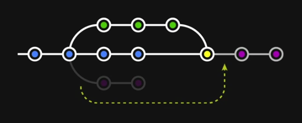

# [제대로 파는 Git & Github] 3. 차원 넘나들기

> 사이트: https://inf.run/4Pro


- 목차
  - 여러 branch 만들어보기
  - branch를 합치는 두 가지 방법
  - branch 합치기 실습
  - 충돌 해결하기
  - SourceTree로 진행해보기


## 1. 여러 branch 만들어보기

#### Branch: 분기된 가지 (다른 차원)

- 프로젝트를 하나 이상의 모습으로 관리해야 할 때
  - 예) 실배포용, 테스트 서버용, 새로운 시도용
- 여러 작업들이 각각 독립되어 진행될 때
  - 예) 신기능 1, 신기능 2, 코드개선, 긴급수정 ...
  - 각각의 차원에서 작업한 뒤 확정된 것을 메인 차원에 통합

이 모든 것을 하나의 프로젝트 폴더에서 진행할 수 있도록!


### (1) 브랜치 생성 / 이동 / 삭제하기

- `add-coach`란 이름의 브랜치 생성

```shell
git branch add-coach
```

- 브랜치 목록 확인

```shell
git branch
```

- `add-coach` 브랜치로 이동
  - `checkout` 명령어가 Git 2.23 버전부터 `switch`, `restore`로 분리

```shell
git switch add-coach
```


#### 브랜치 생성과 동시에 이동하기

```shell
git switch -c new-teams
```

- 기존의 `git checkout -b (새 브랜치명)`


#### 브랜치 삭제하기

```shell
git branch -d (삭제할 브랜치명)
```

- `to-delete` 브랜치 만들고 삭제해보기


> **추가 사항**
>
> 지워질 브랜치에만 있는 내용의 커밋이 있을 경우
>
> 즉 다른 브랜치로 가져오지 않은 내용이 있는 브랜치를 지울 때는
>
> `-d` 대신 `-D`(대문자)로 강제 삭제해야 합니다.
>
> ```shell
> git branch -D (강제삭제할 브랜치명)
> ```


#### 브랜치 이름 바꾸기

```shell
git branch -m (기존 브랜치명) (새 브랜치명)
```


### (2) 각각의 브랜치에서 서로 다른 작업해보기

#### A. `main` 브랜치

- Leopards의 `members`에 `Olivia` 추가
  - 커밋 메시지: `Add Olivia to Leopards`
- Panthers의 `members`에 `Freddie` 추가
  - 커밋 메시지: `Add Freddie to Panthers`
- `add-coach` 브랜치로 이동하여 해당 코드들 확인


#### B. `add-coach` 브랜치

- Tigers의 매니저 정보 아래 `coach: Grace` 추가
  - 커밋 메시지: `Add Coach Grace to Tigers`
- Leopards의 매니저 정보 아래 `coach: Oscar` 추가
  - 커밋 메시지: `Add Coach Oscar to Leopards`
- Panthers의 매니저 정보 아래 `coach: Teddy` 추가
  - 커밋 메시지: `Add Coach Teddy to Panthers`


#### C. `new-teams` 브랜치

- `pumas.yaml` 추가
  - 커밋 메시지: `Add team Pumas`

```yaml
team: Pumas

manager: Jude

members:
- Ezra
- Carter
- Finn
```


- `jaguars.yaml`
  - 커밋 메시지: `Add team Jaguars`

```yaml
team: Jaguars

manager: Stanley

members:
- Caleb
- Harvey
- Myles
```


### (3) 결과 살펴보기

- `git log`: 위치한 브랜치에서의 내역만 볼 수 있음
- 여러 브랜치의 내역 편리하게 보기

```shell
git log --all --decorate --oneline --graph
```


- 소스트리에서 확인


## 2. branch를 합치는 두 가지 방법


- 현재 브랜치 상황


### 서로 다른 브랜치를 합치는 두 방식

- `merge`: 두 브랜치를 한 커밋에 이어붙입니다.

  - 브랜치 사용내역을 남길 필요가 있을 때 적합한 방식
  - 다른 형태의 merge에 대해서도 이후 다루게 될 것입니다.

  

  - 새로 생기는 노란색 커밋에 3개의 초록색 커밋이 한꺼번에 적용된다고 생각하면 된다.

  

- `rebase`: 브랜치를 다른 브랜치에 이어붙입니다.

  - 한 줄로 깔끔히 정리된 내역을 유지하기 원할 때 적합합니다.
  - 이미 팀원과 공유된 커밋들에 대해서는 사용하지 않는 것이 좋습니다.

  

  - 보라색 커밋들을 일일이 하나하나 커밋한 것과 같다고 생각하면 된다.


- `merge` vs `rebase`
  - 히스토리, 커밋 내역이 다름
  - `merge`는 브랜치의 흔적을 남기고, `rebase`는 남기지 않는다.
    - 많은 브랜치가 사용되는 프로젝트에서는 브랜치가 복잡해질 수 있다.


## 3. branch 합치기 실습

### (1) `merge`로 합치기

- `add-coach` 브랜치를 `main` 브랜치로 merge

  - `main` 브랜치로 이동
  - 아래의 명령어로 병합

  ```shell
  git merge add-coach
  ```


> `merge`는 `reset`으로 되돌리기 가능
>
> - `merge`도 하나의 커밋
> - `merge`하기 전 해당 브랜치의 마지막 시점으로


- 병합된 브랜치는 삭제

```shell
git branch -d add-coach
```


### (2) `rebase`로 합치기

- `new-teams` 브랜치를 `main` 브랜치로 rebase

  - `new-teams` 브랜치로 이동 (`merge` 때랑은 반대임!!)
  - 아래의 명령어로 병합

  ```shell
  git rebase main
  ```

- 소스트리에서 상태 확인

  - `main` 브랜치는 뒤쳐져 있는 상황

- `main` 브랜치로 이동 후 아래 명령어로 `new-teams`의 시점으로 **fast-forward**

  ```shell
  git merge new-teams
  ```

- `new-teams` 브랜치 삭제


## 4. 충돌 해결하기

#### 브랜치 간 충돌

- 파일의 같은 위치에 다른 내용이 입력된 상황


#### 상황 만들기

- `conflict-1`, `conflict-2` 브랜치 생성
- `main` 브랜치
  - Tigers의 `manager`를 `Kenneth`로 변경
  - Leopards의 `coach`를 `Nicholas`로 변경
  - Panthers의 `coach`를 `Shirley`로 변경
  - 커밋 메시지: `Edit Tigers, Leopards, Panthers`
- `conflict-1` 브랜치
  - Tigers의 `manager`를 `Deborah`로 변경
  - 커밋 메시지: `Edit Tigers`
- `conflict-2` 브랜치 1차
  - Leopards의 `coach`를 `Melissa`로 변경
  - 커밋 메시지: `Edit Leopards`
- `conflict-2` 브랜치 2차
  - Panthers의 `coach`를 `Raymond`로 변경
  - 커밋 메시지: `Edit Panthers`


### (1) `merge` 충돌 해결하기

- `git merge conflict-1`로 병합 시도하면 충돌 발생
  - 오류 메시지와 `git status` 확인
- 당장 해결이 어려운 경우, 아래 명령어로 `merge` 중단

```shell
git merge --abort
```

- 해결 가능 시 충돌 부분을 수정한 뒤 `git add .`, `git commit`으로 병합 완료


### (2) `rebase` 충돌 해결하기

- `conflict-2`에서 `git rebase main`로 리베이스 시도하면 충돌 발생
  - 오류 메시지와 `git status` 확인
- 당장 해결이 어려운 경우, 아래 명령어로 `merge` 중단

```shell
git rebase --abort
```

- 해결 가능 시 

  - 충돌 부분을 수정한 뒤 `git add .`
  - 아래 명령어로 계속

  ```shell
  git rebase --continue
  ```

  - 충돌이 모두 해결될 때까지 반복


- `main`에서 `git merge conflict-2`로 마무리
- `conflict-1`, `conflict-2` 삭제


## 5. SourceTree로 진행해보기

https://www.yalco.kr/@git-github/3-5/