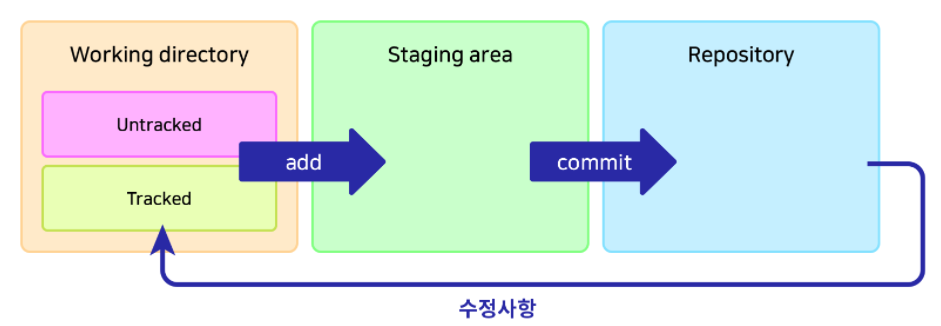

# [제대로 파는 Git & Github] 5. Git 보다 깊이 알기

> 사이트: https://inf.run/4Pro


- 목차
  - Git을 특별하게 만드는 것
  - Git의 3가지 공간
  - HEAD
  - fetch vs .pull


## 1. Git을 특별하게 만드는 것

- 다른 VCS와 비교했을 때, Git의 장점
  - Snapshot 사용
    - 델타 방식 vs 스냅샷 방식
      - 커밋이 아주 많은 경우, 델타 방식은 처음부터 변경 사항들을 쭉 더해나가야 하므로 속도가 느려질 수 있다.
      - 반면에 스냅샷 방식은 그냥 현 시점의 코드를 전부 저장하므로 속도가 비교적 빠르다.
  - 분산 버전 관리 시스템
    - 중앙 집중식 버전 관리 vs 분산 버전 관리

 


## 2. Git의 3가지 공간


### (1) Git의 3가지 공간



- 수정사항 화살표
  - `commit`되어 레포지토리에 들어간 후 수정사항이 발생하면 `tracked` 파일로써 스테이징을 기다리게 된다.


- Working directory
  - untracked: Add 된 적 없는 파일, ignore 된 파일
  - tracked: Add 된 적 있고 변경 내역이 있는 파일
  - `git add` 명령어로 Staging area로 이동
- Staging area
  - 커밋을 위한 준비 단계
    - 예시: 커밋을 위해 선택된 파일들
  - `git commit` 명령어로 레포지토리로 이동
- Repository
  - `.git directory`라고도 불림
  - 커밋된 상태


위의 개념을 어려워하시는 분들이 계서서 아래 내용을 추가합니다.

어떤 파일을 **그릇**으로 비유해보겠습니다.

| 상태                 | 설명                                                         |
| -------------------- | ------------------------------------------------------------ |
| untracked            | 식기세척기에 들어가 본 적이 없거나 식기세척기 사용이 불가(ignored)한 그릇 |
| tracked              | 식기세척기에 들어가 본 적이 있고 식기세척기 사용이 가능한 그릇 |
| add                  | 식기세척기에 넣는 행위                                       |
| staging area         | 식기세척기 안(에 들어간 상태)                                |
| commit               | 세척(식기세척기 가동)                                        |
| repository           | 세척되어 깨끗해진 상태                                       |
| 파일에 수정이 가해짐 | 그릇이 사용되어 이물질(커밋되지 않은 변경사항)이 묻음        |
| working directory    | 세척되어야 하는 상태                                         |

- tracked가 된다는 건, Git의 관리대상에 정식으로 등록됨을 의미한다.
- 새로 추가되는 파일은 반드시 add 해줌으로써, 해당 파일이 tracked 될 것임을 명시해야 하는 이유입니다. 
  - Git이 새 파일들을 무조건 다 관리해버리는 것을 방지


### (2) 파일의 삭제와 이동

- `git rm`
  - `tigers.yaml`를 삭제해본 뒤 `git status`로 살펴보기
    - 파일의 삭제가 `working directory`에 있음
    - `git reset --hard`로 복원
    - 빨간 글씨로 뜨면 working directory에 있다는 뜻
  - `git rm tigers.yaml`로 삭제하고 `git status`로 살펴보기
    - `tigers.yaml` 파일이 삭제되면서 동시에 해당 파일의 삭제가 Staging area로 간다.
    - 파일의 삭제가 `Staging area`에 있음
    - `git reset --hard`로 복원
- `git mv`
  - `tigers.yaml`를 `zzamtigers.yaml`로 이름 변경 뒤 `git status`로 살펴보기
  - 복원 후 `git mv tigers.yaml zzamtigers.yaml`로 실행 뒤 비교


### (3) 파일을 `staging area`에서 `working directory`로

```shell
git restore --staged (파일명)
```

- 예전: `git reset HEAD (파일명)`
- 스테이징에 올려놨는데, 그냥 다음 커밋에 올리고 싶은 경우 사용


### (4) `working directory`에 있는 파일의 수정사항을 원래대로 되돌리기

```shell
git restore (파일명)
```


### (5) `reset`의 세 가지 옵션

- `--soft`: `repository`에서 `staging area`로 이동
- `--mixed` (default): `repository`에서 `working directory`로 이동
- `--hard`: 수정사항 완전히 삭제 
  - working directory에서도 날려버림


## 3. HEAD

### (1) Git의 HEAD

- 현재 속한 브랜치의 가장 최신 커밋
  - switch로 브랜치 이동해보기 (`main`과 `delta-branch`)


- `checkout`으로 앞뒤 이동해보기

```shell
git checkout HEAD^
```

- `^` 또는 `~`: 갯수만큼 이전으로 이동
  - `git checkout HEAD^^^`, `git checkout HEAD~5`
- 커밋 해시를 사용해서도 이동 가능
  - `git checkout (커밋 해시)`
- `git checkout -`: (이동을) 한 단계 되돌리기


### (2) 이전으로 checkout된 상태에서 소스트리로 HEAD 상태 보기

익명의 브랜치에 위치함을 알 수 있음

- `checkout`으로 이전으로 돌아간 뒤
  - 기존 브랜치로 돌아오기: `git switch (브랜치명)`
  - 새 브랜치 만들어보기
  - 새 커밋 만들어보기


### (3) HEAD 사용하여 reset하기

```shell
git reset HEAD(원하는 단계) (옵션)
```


## 4. fetch vs .pull

### (1) `fetch`와 `pull`의 차이

- `fetch`: 원격 저장소의 최신 커밋을 로컬로 가져오기만 함
- `pull`: 원격 저장소의 최신 커밋을 로컬로 가져와 `merge` 또는 `rebase`


### (2) `fetch`한 내역 적용 전 살펴보기

- 원격의 `main` 브랜치에 커밋 추가
  - `git checkout origin/main`으로 확인해보기
  - 원격의 브랜치로 이동할 때는 checkout을 쓴다. switch가 아니라.
- 원격의 변경사항 `fetch`
  - `git checkout origin/main`으로 확인해보기
  - `pull`로 적용


### (3) 원격의 새 브랜치 확인

- `git checkout origin/(브랜치명)`
  - 일단은 해당 브랜치를 확인만 해보고 싶다
- `git switch -t origin/(브랜치명)`
  - 해당 브랜치를 다운받고 이동