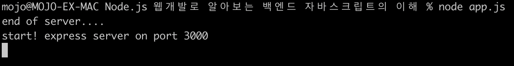

# [Node.js 웹개발로 알아보는 백엔드 자바스크립트의 이해] 섹션 1. nodeJS + Express 웹서버 설정

> [인프런](https://www.inflearn.com/course/node-js-%EC%9B%B9%EA%B0%9C%EB%B0%9C)
>
> [실습 코드 - 깃허브](https://github.com/crongro/node_server_inflearn)


### 목차

- NPM Project 시작하기
- Express 기반 웹서버 구동
- URL Routing 처리
- static 디렉토리 설정


## \#1 NPM Project 시작하기

- npm (node packaging manager)
  - [공식 문서](https://docs.npmjs.com/about-npm)


- 시작하기!

  ```shell
  mojo@MOJO-EX-MAC node-prac-1 % npm init
  This utility will walk you through creating a package.json file.
  It only covers the most common items, and tries to guess sensible defaults.
  
  See `npm help init` for definitive documentation on these fields
  and exactly what they do.
  
  Use `npm install <pkg>` afterwards to install a package and
  save it as a dependency in the package.json file.
  
  Press ^C at any time to quit.
  ```

  - 빈 폴더 만들고 `npm init` 타이핑

  

  ```shell
  package name: (node.js-웹개발로-알아보는-백엔드-자바스크립트의-이해) nodeserver
  version: (1.0.0)
  description: nodeserver test
  entry point: (index.js)
  test command:
  git repository:
  keywords:
  author:
  license: (ISC)
  About to write to /Users/mojo/Documents/Practice/Node.js 웹개발로 알아보는 백엔드 자바스크립트의 이해/package.json:
  
  {
    "name": "nodeserver",
    "version": "1.0.0",
    "description": "nodeserver test",
    "main": "index.js",
    "scripts": {
      "test": "echo \"Error: no test specified\" && exit 1"
    },
    "author": "",
    "license": "ISC"
  }
  
  
  Is this OK? (yes) yes
  ```

  - package name,  description만 입력하고 나머지 다 엔터
  - 완료하고 나면, 위와 같은 `package.json` 파일이 생긴다.


- 이번 강좌에서는 Express라는 웹 서버를 사용한다.

  - express를 설치하기 위해 아래 명령어를 입력하자.

  - `npm install express --save` 
    
    - `--save` 옵션은 install한 express 정보를 `package.json`에 저장해서 나중에 이 패키지를 받는 사람이 자동으로 다운받을 수 있게 해준다.
    
    - 즉, 이 노드 프로젝트가 가지고 있는 (의존하고 있는) 외부 라이브러리 정보를 모두 `package.json`에 저장하게 된다.
    
      
    
    
    
    - `node_modules`, `package-lock.json`이 생겼다.
    - `package.json`도 업데이트 되었다.
    
    
    
    
    
    - dependencies 속성에 express가 추가된다!
    
    
    
    
    
    - express가 필요로 하는 라이브러리들이 다 여기에 존재하게 된다. (엄청 많다...)
    


## \#2 Express 기반 웹서버 구동

- 이번 시간에는 node로 웹서버를 직접 띄워보자

- 프로젝트 폴더에 `app.js` 파일을 만들어 보자.

  - `vi app.js`후 아래 코드 타이핑

  - ```javascript
    var express = require('express'); --- (1)
    var app = express(); --- (2)
    app.listen(3000, function() {  --- (3)
      console.log('start! express server on port 3000');
    });
    ```

    - (1)번 코드 

      - require가 무슨 역할이냐?

        -> node_modules 폴더에 있는 express 관련된 파일 속의 함수들을 가져오는 역할을 한다.

      - `require('express')`는 반환값이 함수 형태다.

    - (2)번 코드

      - `express`가 함수기 때문에 `express()` 형태로 호출할 수 있다.
      - `express()`로 반환되는 객체(함수 정보)를 app 변수에 저장하고 있다.

    - (3)번 코드

      - 3000번 포트로 서버 시작

- 서버 실행
  - `node app.js` 
  - 프로그램 실행하고 나면 로그로 찍힌 후에 계속 대기하고 있게 된다.
  - 웹 브라우저(크롬)의 주소창에 `localhost:3000`으로 접속하면 
    - `Cannot GET /`이라는 응답을 받게 된다.
  - 서버 종료는 `Ctrl + C`


- 기존 코드 마지막에 한 줄 추가

  - ```javascript
    var express = require('express'); 
    var app = express();
    app.listen(3000, function() { 
      console.log('start! express server on port 3000');
    });
    
    console.log('end of server....'); // 이 줄 추가
    ```

  - 다시 실행해보면, 아래와 같이 나온다

    

    - `app.listen(포트번호, 콜백함수)` 형태로 되어 있기 때문에(비동기 처리) 해당 함수 안의 코드는 나중에 처리됨
  


- 코드 다시 수정

  - ```javascript
    var express = require('express'); 
    var app = express();
    app.listen(3000, function() { 
      console.log('start! express server on port 3000');
    });
    
    // 아래처럼 수정
    for(var i = 0; i < 10000; i++) {
    	console.log('end of server....'); 
    }
    ```

    - 만 번 for문 코드(synchronous 코드)가 실행된 후, asynchronous 코드가 실행된다.

    

여기서 잠깐,,

- 문제점
  - 우리가 `app.js`를 수정할 때마다 `vi app.js`하고 `node app.js` 타이핑 하기가 귀찮다.
- 해결책
  - 자동으로 파일의 변경을 감지해서 서버를 올렸다가 내려주는 방법이 있다.
  - `nodemon`을 설치하자!!


- `nodemon` 설치
  - `npm install nodemon --save` 
    - `--save` 옵션: 해당 프로젝트에만 `nodemon`을 설치
  - `npm install nodemon -g`
    - `-g` 옵션 (global 옵션): 내 PC의 어느 디렉토리에서나 `nodemon`을 실행하면 바로 실행될 수 있게 해준다.
  - 나는 `-g` 옵션을 줘서 깔아줫따.


- `nodemon`으로 서버 실행
  - `nodemon app.js` 


## \#3 URL Routing 처리

- 예제

  ```javascript
  var express = require('express'); 
  var app = express();
  
  app.listen(3000, function() { 
    console.log('start! express server on port 3000');
  });
  
  
  // http method GET 요청
  app.get('/', function(req, res) {
    res.send('<h1>hi friend!</h1>');
  })
  ```

  - `http://localhost:3000/`으로 GET 요청 보내면 `<h1>hi friend!</h1>` 응답 받음


- 예제 2

  ```javascript
  var express = require('express');
  var app = express();
  app.listen(3000, function() {
    console.log('start! express server on port 3000');
  });
  
  app.get('/', function(req, res) {
    res.sendFile('/Users/mojo/Documents/Practice/Node.js 웹개발로 알아보는 백엔드 자바스크립트의 이해/public/main.html');
    // res.sendFile(__dirname + '/public/main.html');
  });
  ```

  - `http://localhost:3000/`으로 GET 요청 보내면 위에 명시된 절대 경로에 위치한 `main.html` 파일 응답하기

  - 근데 절대 경로 일일이 다 써주기가 너무 귀찮다..

  - `'/Users/mojo/Documents/Practice/Node.js 웹개발로 알아보는 백엔드 자바스크립트의 이해/public/main.html'`를 **`__dirname`**이라는 <u>현재 실행 중인 폴더 경로</u>를 나타내는 이미 정의된 값을 이용하면 아래와 같이 Refactoring 할 수 있다.

    - ` res.sendFile(__dirname + '/public/main.html');`

    


## \#4 static 디렉토리 설정

- 이번엔 `main.html`에 script를 추가해보자.

- **main.html**

  ```html
  <!doctype html>
  <html lang="en">
  <body>
    <!-- your content here... -->
    <h1>Hello, world!</h1>
  
    <script src="main.js"></script> <!-- 추가 -->
  </body>
  </html>
  ```

  - `<script src="main.js"></script>`를 추가하고 서버를 다시 실행시키면, `main.js` 파일이 안온다. (404 에러남)
    - 왜냐면 node가 `main.js` 파일을 `localhost:3000/main.js`로 요청을 하기 때문


- script, img, css 파일들처럼 정적인 파일들을 static 파일들이라고 한다.

  - 이런 애들은 서버가 요청 받으면 별도로 다른 처리를 할 필요 없이 그냥 보내주기만 하면 됨.

  - express에 static 디렉토리를 등록해두면 바로바로 보내준다.

    - `app.use(express.static('public'));` 
    - 위 코드는 `public`이란 폴더를 static 디렉토리로 설정한다는 뜻이다.

  - 예제

    ```javascript
    var express = require('express');
    var app = express();
    app.listen(3000, function() {
            console.log('start! express server on port 3000');
    });
    
    app.use(express.static('public')); // 추가!!!
    
    app.get('/', function(req, res) {
      res.sendFile(__dirname + '/public/main.html');
    });
    ```

    
